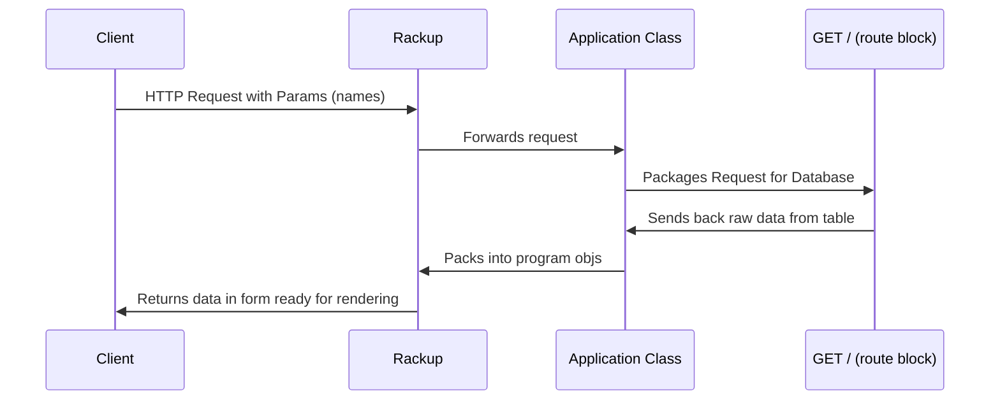

# get/sort names methods

## 1. Design the Route Signature

### get names method

HTTP path => http://localhost:9292/names

Params => request parameter - names: a list of strings (names)

### sort-names method

HTTP path => http://localhost:9292/sort-names

Params => body parameter - names: a list of names seperate by ',' with no white space

returns the names sort in alphabetical order in the same format

You'll need to include:
  * the HTTP method
  * the path
  * any query parameters (passed in the URL)
  * or body parameters (passed in the request body)

## 2. The Response

```html

http://localhost:9292/names?names=['Julia', 'Mary', 'Karim']


<!-- Response when the post is found: 200 OK -->

<html>
  <head></head>
  <body>
    Julia, Mary, Karim
  </body>
</html>
```

```html
<!-- EXAMPLE -->

http://localhost:9292/sort-names?names=Joe,Alice,Zoe,Julia,Kieran

<!-- Response when the post is found: 200 OK -->


Alice,Joe,Julia,Kieran,Zoe

```

## 3. Examples


```
# Request:

GET /names?names=['Julia', 'Mary', 'Karim']

# Expected response:

Response for 200 OK

Returns the names formatted as a string => "Julia, Mary, Karim"


```

```
# Request:

POST /sort-names?names=Joe,Alice,Zoe,Julia,Kieran

# Expected response:

Response for 200 OK

Returns the names sorted as a string => "Alice,Joe,Julia,Kieran,Zoe"

```

## Sequence Diagram



## Same sequence diagram, but rendered on Mermaid live.

[](https://mermaid.live/edit#pako:eNpdkU1rAjEQhv_KkJMFS-85CEX7cRT1uJfZ7Kymm022kwQR8b93RqmIl83CPPO-D8nZuNSRsSbTb6XoaOVxzzg2EWBCLt75CWOBZQDM8vUUy_Nsg06Hcgx1eh6-T5MO5QjeYfEpSgrm_Mx9feyU0-MNZpxqIWhDcsOLklL_ulhohYXv3W4NG9XNBY6-HGCNYpxhFnGkfOVVSRek1sJn4iNyl4FvSwqolgLSZ2XfDbinfE_tE8MKC7aYSWm1usdtKUpWKzvAeIROOOg5jSB8oMfwq66GZ_CxJJg46d1Can_yo-UyWKkulWO-xfmoCqMIY3e62rCUEvu4N3MzEo_oO3m0s6Y0phxopMZY-e2oxxpKY5p4ERRrSdtTdMYWrjQ3dZL8_zc2tseQ6fIHnjGuFA)

## 4. Tests Examples

```ruby
# EXAMPLE
# file: spec/integration/application_spec.rb

require "spec_helper"
require "rack/test"
require_relative '../../app'

describe Application do
  # This is so we can use rack-test helper methods.
  include Rack::Test::Methods

  # We need to declare the `app` value by instantiating the Application
  # class so our tests work.
  let(:app) { Application.new }


  context "GET to /names" do
    it "returns 200 OK with the right content" do
      # Send a GET request to /
      # and returns a response object we can test.
      response = get("/names", names: ['Julia', 'Mary', 'Karim'])
      

      # Assert the response status code and body.
      expect(response.status).to eq(200)
      expect(response.body).to eq("Julia, Mary, Karim")
    end
  end
  context "POST to /sort-names" do
    it "returns 200 OK with names sorted" do
      # Send a GET request to /
      # and returns a response object we can test.
      response = post("/sort-names", names: 'Joe,Alice,Zoe,Julia,Kieran')
      

      # Assert the response status code and body.
      expect(response.status).to eq(200)
      expect(response.body).to eq("Alice,Joe,Julia,Kieran,Zoe")
    end
  end
end
```

## 5. Implementation

```ruby

require 'sinatra/base'
require 'sinatra/reloader'

class Application < Sinatra::Base
  get '/' do
    "This is a test"
  end

  get '/hello' do
    name = params[:name]
    return "Hello! Your name is.... *inserts magical music*, #{name}!"
  end

  get '/names' do
    names = params[:names]
    result = names.join(', ')
    return result
  end

  post '/submit' do
    name = params[:name]
    message = params[:message]
    return "Thanks #{name}, you sent this message: \"#{message}\""
  end

  post '/sort-names' do
    names = params[:names]
    names = names.split(/\W+/).sort.join(',')
    return names
  end  

  configure :development do
    register Sinatra::Reloader
  end
end

```